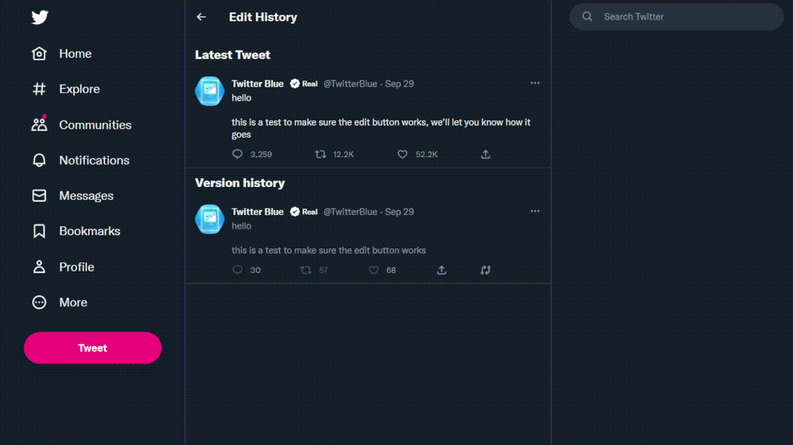
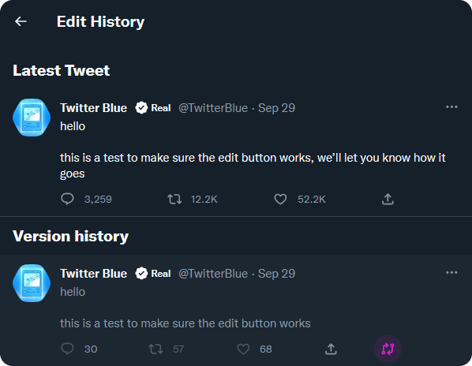
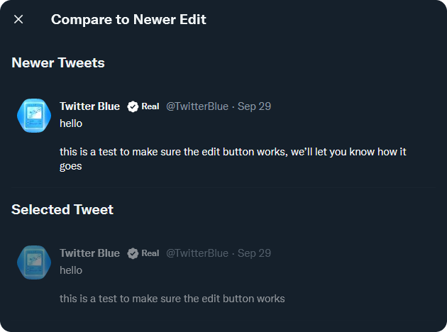
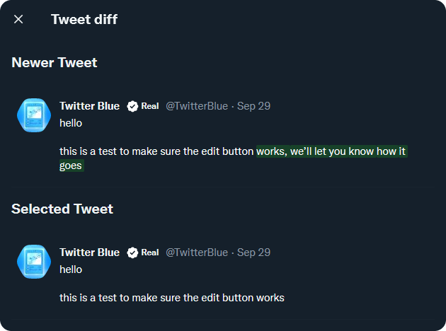

# twiffs

twiffs is a browser extension that a native-like experience for showing diff highlighting for edited tweets.

twiffs uses a dynamic programming solution to the [LCS](https://en.wikipedia.org/wiki/longest_common_subsequence_problem) problem to find the common subsequence between two selected tweets, and highlights them accordingly.

By leveraging native twitter elements, twiffs has a near-native feeling to it.

## Installation

### Chromium

Install the Chrome extension from the [Chrome Web Store](https://chrome.google.com/webstore/detail/twiffs/hkiaophoncefocbhepelnemjpdcddmpf).

1. Download the latest Chrome release from the [releases page](https://github.com/maxmmyron/twitterdiffs/releases/tag/1.0)

### Firefox

Install the firefox extension from [Firefox Browser Add-ons](https://addons.mozilla.org/en-US/firefox/addon/twiffs/) page.

1. Download the latest Firefox release from the [releases page](https://github.com/maxmmyron/twitterdiffs/releases/tag/1.0)

## Usage

1. Navigate to the edit history for any tweet that has been edited.

2. Click the diff icon on any older tweet.

   

3. Choose a newer tweet to compare the selected tweet against.

   

4. See the diff highlighted between the two selected tweets!

   
